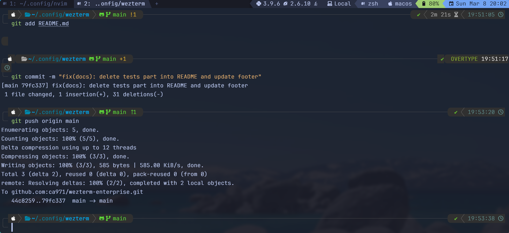

<div align="center">

#  WezTerm Enterprise

**Enterprise-Grade · Cross-Platform · Ultra-Modular · OOP Architecture · Information Center**

A meticulously engineered, production-ready WezTerm configuration framework
designed for professional developers and DevOps engineers.

<br/>

[](https://wezfurlong.org/wezterm/)
[](https://www.lua.org/)
[](./LICENSE)
[](#-cross-platform-support)
[](https://github.com/ca971/wezterm-enterprise/actions)

[](#-project-structure)
[](#-theme-gallery)
[](#-information-center-status-bar)
[](#-multi-shell-support)
[](https://github.com/ca971/wezterm-enterprise)

<br/>

<picture>
  <source media="(prefers-color-scheme: dark)" srcset="assets/screenshot-dark.png">
  <source media="(prefers-color-scheme: light)" srcset="assets/screenshot-light.png">
  
</picture>

<br/><br/>

[Features](#-key-features) •
[Install](#-installation) •
[Keybindings](#%EF%B8%8F-keybinding-reference) •
[Themes](#-theme-gallery) •
[Bar](#-information-center-status-bar) •
[Wiki](https://github.com/ca971/wezterm-enterprise/wiki)

</div>

---

## 📑 Table of Contents

<details>
<summary><strong>Click to expand</strong></summary>

- [💎 The Enterprise Edge](#-the-enterprise-edge)
- [✨ Core Philosophy](#-core-philosophy)
- [🚀 Key Features](#-key-features)
- [🌐 Cross-Platform Support](#-cross-platform-support)
- [📦 Requirements](#-requirements)
- [🔧 Installation](#-installation)
- [⚙️ Post-Installation](#%EF%B8%8F-post-installation)
- [⌨️ Keybinding Reference](#%EF%B8%8F-keybinding-reference)
- [📊 Information Center (Status Bar)](#-information-center-status-bar)
- [🎨 Theme Gallery](#-theme-gallery)
- [🔐 Secrets Management](#-secrets-management)
- [🎛️ Configuration & Settings Engine](#%EF%B8%8F-configuration--settings-engine)
- [📁 Project Structure](#-project-structure)
- [🐚 Multi-Shell Support](#-multi-shell-support)
- [🧪 Testing](#-testing)
- [⚡ Architecture Deep Dive](#-architecture-deep-dive)
- [🤝 Contributing](#-contributing)
- [📄 License](#-license)

</details>

---

## 💎 The Enterprise Edge

> **WezTerm Enterprise** isn't just another dotfile collection — it's a **structured ecosystem** built on
> corporate-grade engineering principles: OOP architecture, security, modularity, and cross-platform reliability.

Whether you're a DevOps engineer managing Kubernetes clusters, a developer SSH'ing into
production servers, or a team lead standardizing terminal configurations —
**WezTerm Enterprise scales with your needs**.

```
┌─────────────────────────────────────────────────────────────────────┐
│                   WezTerm Enterprise Stack                          │
├─────────────────────────────────────────────────────────────────────┤
│                                                                     │
│  ┌───────────┐  ┌───────────┐  ┌───────────┐  ┌─────────────────┐   │
│  │  Themes   │  │  Status   │  │  Events   │  │   Highlights    │   │
│  │  Engine   │  │   Bar     │  │  System   │  │    Engine       │   │
│  │  10 built │  │ 15 segs   │  │  9 hooks  │  │  URL·IP·Hash    │   │
│  │  +custom  │  │ info ctr  │  │  +custom  │  │  Path·Error     │   │
│  └─────┬─────┘  └─────┬─────┘  └─────┬─────┘  └──────┬──────────┘   │
│        │              │              │               │              │
│  ┌─────▼──────────────▼──────────────▼───────────────▼───────────┐  │
│  │       Core Layer (Settings · Colors · Icons · Fonts · Keys)   │  │
│  │    settings · colors · icons · fonts · appearance · tabs      │  │
│  │    keybindings · launch · multiplexer                         │  │
│  └───────────────────────────┬───────────────────────────────────┘  │
│                              │                                      │
│  ┌───────────────────────────▼───────────────────────────────────┐  │
│  │        Library Layer (OOP / Utilities / Cross-Platform)       │  │
│  │  class · guard · logger · platform · shell · cache · process  │  │
│  │  secrets · validator · event_emitter · path · table · string  │  │
│  └───────────────────────────┬───────────────────────────────────┘  │
│                              │                                      │
│  ┌───────────────────────────▼───────────────────────────────────┐  │
│  │         WezTerm Runtime (GPU-accelerated · Multiplexer)       │  │
│  └───────────────────────────────────────────────────────────────┘  │
│                                                                     │
│  ┌───────────────────────────────────────────────────────────────┐  │
│  │        Local Overrides (gitignored · per-machine)             │  │
│  │  local/settings · local/colors · local/keybindings            │  │
│  │  local/themes · local/secrets                                 │  │
│  └───────────────────────────────────────────────────────────────┘  │
└─────────────────────────────────────────────────────────────────────┘
```

---

## ✨ Core Philosophy

| Principle | Description |
| :--- | :--- |
| 🏗️ **OOP Architecture** | Full class system with inheritance, mixins, interfaces, and sealing |
| 🛡️ **Secure** | Secrets manager, environment variable isolation, no credentials in git |
| ⚡ **Blazing Fast** | Lazy module loading, memoization cache, minimal startup overhead |
| 🧩 **Ultra-Modular** | 68 atomic files — one concern per file, zero circular dependencies |
| 📈 **Scalable** | From a single laptop to fleet-wide deployment across teams and servers |
| 🌐 **Cross-Platform** | Auto OS/WSL/container/SSH detection via `lib/platform.lua` |
| 🔧 **Configurable** | Single `local/settings.lua` to control everything — every option documented |
| 🧪 **Tested** | 53 automated tests across 4 test suites |

---

## 🚀 Key Features

<table>
<tr>
<td width="50%" valign="top">

### 🏗️ OOP Class System

- Full **class system** (`lib/class.lua`) with single inheritance
- **Mixins** for horizontal code reuse
- **Interfaces** with compile-time validation
- **Abstract methods** enforcement
- **Class sealing** to prevent subclassing
- **Instance-of** checks across inheritance chains
- Global **class registry** for introspection

</td>
<td width="50%" valign="top">

### 📊 Information Center (Status Bar)

- **15 segments** providing real-time system intelligence
- **Environment detection**: Docker, Kubernetes, SSH, Mosh, VPS, Proxmox, OPNsense, WSL
- **Runtime detection**: Node, Python, Ruby, Go, Rust, Lua, Nix, Deno, Bun, Java
- **Tool detection**: tmux, Docker, Podman, kubectl, Helm, Terraform
- Git branch & dirty/clean status
- Battery with adaptive color
- Configurable segment order and style

</td>
</tr>
<tr>
<td width="50%" valign="top">

### 🎨 Theme Engine (10 Premium Themes)

- **Catppuccin Mocha** & **Macchiato** — warm darks
- **Tokyo Night** & **Storm** — deep blue darks
- **Rosé Pine** & **Moon** — soft muted darks
- **Kanagawa** — Japanese ink wash
- **Gruvbox Dark** — retro warm
- **Nord** — arctic blue
- **Dracula** — purple-centric
- Runtime theme cycling with `Leader → t`
- Custom themes via `local/themes.lua`

</td>
<td width="50%" valign="top">

### 🔐 Security & Secrets

- **Secrets Manager** (`lib/secrets.lua`) with 3 sources:
  - Environment variables (`WEZTERM_*` prefix)
  - Local secrets file (`local/secrets.lua`, gitignored)
  - macOS Keychain (opt-in)
- SSH domain credentials via `"secret:KEY"` references
- Zero credentials in version control
- Structured logging that **never** exposes secret values
- Frozen/read-only configuration tables

</td>
</tr>
<tr>
<td width="50%" valign="top">

### 🌐 Environment Intelligence

Automatic detection of your runtime context:

- 🐳 **Docker** containers (`.dockerenv`, cgroups)
- ☸️ **Kubernetes** pods (service host, secrets mount)
- 🔒 **SSH** / **Mosh** remote sessions
- 🖥️ **Proxmox VE** hypervisors
- 🛡️ **OPNsense** firewalls
- ☁️ **VPS/Cloud** instances (AWS, GCP, Hetzner, DO…)
- 📦 **Podman** containers
- 🪟 **WSL1 / WSL2** detection

</td>
<td width="50%" valign="top">

### 🧰 Developer Tooling

- **Structured logging** with 6 levels (TRACE → FATAL)
- **Configuration validator** with schema definitions
- **Custom event bus** for internal pub/sub
- **Memoization cache** with TTL and LRU eviction
- **Cross-platform paths** with home expansion
- **Defensive guards** for runtime type safety
- **Deep merge** engine for configuration cascading
- **Hyperlink rules** for URLs, IPs, git hashes, file paths

</td>
</tr>
</table>

---

## 🌐 Cross-Platform Support

> Automatic detection via `lib/platform.lua` — optimizations applied transparently.

| Platform | Status | Notes |
| :--- | :---: | :--- |
| 🍎 macOS | ✅ | `CMD` as super key, blur, Homebrew shell detection |
| 🐧 Linux (Ubuntu, Fedora, Arch…) | ✅ | `ALT` as super key, all distros |
| 🪟 Windows | ✅ | WSL distribution listing, PowerShell, cmd.exe |
| 🖥️ WSL / WSL2 | ✅ | Auto-detected, version-aware |
| 😈 FreeBSD / OpenBSD | ✅ | BSD-specific path handling |
| 🐳 Docker / Podman | ✅ | Container detection in status bar |
| ☸️ Kubernetes | ✅ | Pod detection, kubectl awareness |
| 🔒 SSH / Mosh | ✅ | Remote session indicator |
| 🖥️ Proxmox VE | ✅ | Hypervisor detection |
| 🛡️ OPNsense | ✅ | Firewall detection |
| ☁️ VPS / Cloud | ✅ | AWS, GCP, Hetzner, DO, Vultr, OVH… |

---

## 📦 Requirements

| Dependency | Version | Purpose | Required |
| :--- | :---: | :--- | :---: |
| [WezTerm](https://wezfurlong.org/wezterm/) | Latest | GPU-accelerated terminal emulator | ✅ |
| [Nerd Font](https://www.nerdfonts.com/) | v3.x | Icon rendering (e.g. JetBrainsMono NF) | ✅ |
| [Git](https://git-scm.com/) | `≥ 2.30` | Version control | ⚠️ |
| Shell | zsh/fish/bash | At least one modern shell | ✅ |
| [Lua](https://www.lua.org/) | `5.4` | Running tests outside WezTerm | ⚠️ |

<details>
<summary><strong>📋 Quick install per platform</strong></summary>

**macOS** (Homebrew):
```bash
brew install --cask wezterm
brew install --cask font-jetbrains-mono-nerd-font
```

**Ubuntu / Debian:**
```bash
curl -fsSL https://apt.fury.io/wez/gpg.key | sudo gpg --yes --dearmor -o /etc/apt/keyrings/wezterm-fury.gpg
echo 'deb [signed-by=/etc/apt/keyrings/wezterm-fury.gpg] https://apt.fury.io/wez/ * *' | sudo tee /etc/apt/sources.list.d/wezterm.list
sudo apt update && sudo apt install wezterm
```

**Arch Linux:**
```bash
sudo pacman -S wezterm ttf-jetbrains-mono-nerd
```

**Fedora:**
```bash
sudo dnf copr enable wezfurlong/wezterm-nightly
sudo dnf install wezterm
```

**Windows** (Scoop):
```powershell
scoop bucket add extras
scoop install wezterm
scoop bucket add nerd-fonts && scoop install JetBrainsMono-NF
```

</details>

---

## 🔧 Installation

### One-Line Install (macOS & Linux)

```bash
git clone https://github.com/ca971/wezterm-enterprise.git ~/.config/wezterm
```

### Windows (PowerShell)

```powershell
git clone https://github.com/ca971/wezterm-enterprise.git "$HOME\.config\wezterm"
```

### With Backup

```bash
# Backup existing config
[ -d ~/.config/wezterm ] && mv ~/.config/wezterm ~/.config/wezterm.bak

# Clone
git clone https://github.com/ca971/wezterm-enterprise.git ~/.config/wezterm
```

> **Launch WezTerm** — the configuration loads automatically. No plugins to install, no build step.

---

## ⚙️ Post-Installation

| Step | Action | Description |
| :---: | :--- | :--- |
| 1 | Launch WezTerm | Configuration auto-loads |
| 2 | `Cmd + ?` / `Alt + ?` | Open the interactive **Cheat Sheet** |
| 3 | Edit `local/settings.lua` | Customize theme, font, shell, segments |
| 4 | `Leader → t` | Cycle through 10 built-in themes |
| 5 | `lua tests/init.lua` | Run the full test suite (optional) |

---

## ⌨️ Keybinding Reference

> **Leader key:** `Ctrl + a` (configurable) — Press `Cmd + ?` for the full interactive cheat sheet.
>
> On **macOS**, `Super` = `Cmd`. On **Linux/Windows**, `Super` = `Alt`.

<details open>
<summary><strong>🗂️ Tab Management</strong></summary>

| Shortcut | Action |
| :--- | :--- |
| `Super + t` | New tab |
| `Super + w` | Close tab (confirm) |
| `Super + {` | Previous tab |
| `Super + }` | Next tab |
| `Super + Shift + {` | Move tab left |
| `Super + Shift + }` | Move tab right |
| `Super + 1-9` | Jump to tab N (9 = last) |

</details>

<details>
<summary><strong>📐 Pane Management</strong></summary>

| Shortcut | Action |
| :--- | :--- |
| `Super + d` | Split pane horizontal |
| `Super + Shift + d` | Split pane vertical |
| `Super + z` | Toggle pane zoom (fullscreen) |
| `Super + x` | Close current pane |

</details>

<details>
<summary><strong>🧭 Pane Navigation & Resizing</strong></summary>

| Shortcut | Action |
| :--- | :--- |
| `Super + Ctrl + ←↑↓→` | Focus pane in direction |
| `Super + Shift + ←↑↓→` | Resize pane in direction |

</details>

<details>
<summary><strong>📋 Clipboard & Search</strong></summary>

| Shortcut | Action |
| :--- | :--- |
| `Super + c` | Copy to clipboard |
| `Super + v` | Paste from clipboard |
| `Super + /` | Open search bar |

</details>

<details>
<summary><strong>📜 Scroll</strong></summary>

| Shortcut | Action |
| :--- | :--- |
| `Super + k` / `Super + j` | Scroll up / down one line |
| `Super + u` / `Super + f` | Scroll up / down half page |
| `Shift + PageUp/PageDown` | Scroll full page |
| `Shift + Home/End` | Scroll to top / bottom |

</details>

<details>
<summary><strong>🔤 Font Size</strong></summary>

| Shortcut | Action |
| :--- | :--- |
| `Super + =` | Increase font size |
| `Super + -` | Decrease font size |
| `Super + 0` | Reset font size |

</details>

<details>
<summary><strong>🚀 Utilities & Leader Sequences</strong></summary>

| Shortcut | Action |
| :--- | :--- |
| `Super + p` | Command palette |
| `Super + l` | Debug overlay |
| `Super + r` | Reload configuration |
| `Super + s` | Workspace switcher (fuzzy) |
| `Super + n` | Next workspace |
| `Super + ?` | **Cheat sheet** |
| `Leader → o` | Toggle window opacity |
| `Leader → t` | Cycle through 10 themes |
| `Leader → ?` | Cheat sheet |

</details>

<details>
<summary><strong>📝 Copy Mode (vi-style)</strong></summary>

| Shortcut | Action |
| :--- | :--- |
| `Ctrl + Shift + x` | Enter copy mode |
| `v` / `V` / `Ctrl + v` | Char / line / block selection |
| `y` | Yank (copy) selection |
| `h/j/k/l` | Move cursor |
| `w/b/e` | Word navigation |
| `0/$` | Start / end of line |
| `g/G` | Top / bottom of scrollback |
| `/` / `?` | Search forward / backward |
| `n/N` | Next / previous match |
| `q` / `Escape` | Exit copy mode |

</details>

---

## 📊 Information Center (Status Bar)

The status bar is a **real-time information center** that adapts to your environment.

```
┌─────────────────────────────────────────────────────────────────────┐
│                                                                     │
│  ┌─────────┐ ┌───────────┐ ┌──────┐ ┌──────┐     ┌─────────────┐    │
│  │  Mode   │ │ Workspace │ │ CWD  │ │ Git  │ ... │  DateTime   │    │
│  │ NORMAL  │ │   main    │ │ ~/p  │ │ main │     │ Mon Jan 14  │    │
│  └─────────┘ └───────────┘ └──────┘ └──────┘     └─────────────┘    │
│                                                                     │
│  LEFT SEGMENTS ◄────────────────────────────► RIGHT SEGMENTS        │
│                                                                     │
└─────────────────────────────────────────────────────────────────────┘
```

### Available Segments

| Segment | Category | Description |
| :--- | :---: | :--- |
| `mode` | 🎯 | Current key mode: NORMAL / COPY / SEARCH / RESIZE |
| `workspace` | 📂 | Active workspace name (hidden if "default") |
| `cwd` | 📁 | Current working directory (shortened) |
| `git` | 🔀 | Git branch + dirty/clean indicator with adaptive color |
| `hostname` | 🖥️ | System hostname (FQDN shortened) |
| `username` | 👤 | Current user |
| `runtimes` | ⚙️ | Detected: Node, Python, Ruby, Go, Rust, Lua, Nix, Deno, Bun, Java |
| `tools` | 🛠️ | Detected: tmux, Docker, Podman, kubectl, Helm, Terraform |
| `environment` | 🌍 | Docker, K8s, SSH, Mosh, VPS, Proxmox, OPNsense, WSL, or Local |
| `shell` | 🐚 | Active shell indicator (zsh / fish / bash / nu / pwsh) |
| `platform` | 💻 | OS indicator (Linux / macOS / Windows / BSD / WSL) |
| `battery` | 🔋 | Battery % with adaptive color and charging icon |
| `datetime` | 📅 | Current date and time |
| `network` | 🌐 | VPN status (opt-in) |
| `keymap` | ⌨️ | Keyboard layout (opt-in) |

### Separator Styles

Configure in `local/settings.lua`:

```lua
bar = {
  separator_style = "powerline",  -- Choose your style
}
```

| Style | Preview | Description |
| :--- | :---: | :--- |
| `powerline` | `` | Classic powerline arrows |
| `slant` | `` | Slanted separators |
| `round` | `` | Rounded separators |
| `block` | `█` | Solid blocks |
| `plain` | `│` | Simple lines |
| `none` | ` ` | Space only |

---

## 🎨 Theme Gallery

> Cycle themes at runtime with `Leader → t`. Set default in `local/settings.lua`.

| # | Theme | Description | Preview Colors |
| :---: | :--- | :--- | :--- |
| 1 | **Catppuccin Mocha** | Warm dark (default) | `#1e1e2e` `#89b4fa` `#a6e3a1` `#f38ba8` |
| 2 | **Catppuccin Macchiato** | Medium dark | `#24273a` `#8aadf4` `#a6da95` `#ed8796` |
| 3 | **Tokyo Night** | Deep blue dark | `#1a1b26` `#7aa2f7` `#9ece6a` `#f7768e` |
| 4 | **Tokyo Night Storm** | Stormy blue | `#24283b` `#7aa2f7` `#9ece6a` `#f7768e` |
| 5 | **Rosé Pine** | Soft muted dark | `#191724` `#31748f` `#9ccfd8` `#eb6f92` |
| 6 | **Rosé Pine Moon** | Lighter muted | `#232136` `#3e8fb0` `#9ccfd8` `#eb6f92` |
| 7 | **Kanagawa** | Japanese ink wash | `#1f1f28` `#7e9cd8` `#76946a` `#c34043` |
| 8 | **Gruvbox Dark** | Retro warm | `#282828` `#458588` `#98971a` `#cc241d` |
| 9 | **Nord** | Arctic blue | `#2e3440` `#81a1c1` `#a3be8c` `#bf616a` |
| 10 | **Dracula** | Purple-centric | `#282a36` `#bd93f9` `#50fa7b` `#ff5555` |

### Custom Themes

Define your own in `local/themes.lua`:

```lua
return {
  my_theme = {
    base = { base = "#0a0a14", text = "#e0e0f0", ... },
    accent = { blue = "#7090f0", red = "#f06080", ... },
    semantic = { success = "#80d090", error = "#f06080", ... },
    ui = { bar_bg = "#0a0a14", tab_active_bg = "#222236", ... },
    ansi = { "#222236", "#f06080", "#80d090", "#f0d080", ... },
    brights = { "#3a3a56", "#f07090", "#90e0a0", "#f0e090", ... },
  },
}
```

Then in `local/settings.lua`:

```lua
theme = { name = "my_theme" }
```

---

## 🔐 Secrets Management

> Zero credentials in version control. Multiple secure sources with priority cascading.

```
Environment Variables (WEZTERM_*)     ← Highest priority
         │
         ▼
macOS Keychain (opt-in)               ← Medium priority
         │
         ▼
local/secrets.lua (gitignored)        ← Lowest priority
```

### Usage in SSH Domains

```lua
-- local/settings.lua
multiplexer = {
  ssh_domains = {
    {
      name = "production",
      remote_address = "secret:prod_host",   -- Loaded from secrets
      username = "secret:prod_user",          -- Loaded from secrets
    },
  },
}
```

```lua
-- local/secrets.lua (NEVER committed)
return {
  prod_host = "10.0.1.50:22",
  prod_user = "deploy",
}
```

Or via environment variables:

```bash
export WEZTERM_PROD_HOST="10.0.1.50:22"
export WEZTERM_PROD_USER="deploy"
```

---

## 🎛️ Configuration & Settings Engine

WezTerm Enterprise uses a **cascading settings engine** with deep-merge inheritance:

```
core/settings.lua              ← Framework defaults (lowest priority)
    │
    ▼
Platform auto-detection        ← macOS/Windows/Linux overrides
    │
    ▼
local/settings.lua             ← Your personal overrides (highest priority)
```

### Example: Personal Configuration

```lua
-- local/settings.lua
return {
  theme = { name = "tokyo_night" },

  font = {
    family = "JetBrainsMono Nerd Font",
    size = 14.0,
    weight = "Light",
    bold_weight = "Regular",
  },

  window = {
    initial_cols = 160,
    initial_rows = 45,
    opacity = 0.92,
  },

  tab_bar = {
    separator = "bottom_right",
  },

  bar = {
    right_segments = {
      "environment", "runtimes", "git",
      "shell", "battery", "datetime",
    },
    separator_style = "round",
  },

  shell = { preferred = { "fish", "zsh", "bash" } },

  features = {
    network_indicator = true,
  },
}
```

### Local Override Files

| File | Purpose |
| :--- | :--- |
| `local/settings.lua` | Override any setting (fonts, themes, shell, bar, features…) |
| `local/colors.lua` | Override individual colors by dot-path (e.g. `["ui.bar_bg"]`) |
| `local/keybindings.lua` | Add or override key bindings |
| `local/themes.lua` | Define custom color themes |
| `local/secrets.lua` | SSH credentials, API keys (⚠️ never committed) |

---

## 📁 Project Structure

> Every file has **one responsibility**. Every directory is a **logical domain**. 68 modules total.

```
~/.config/wezterm/
├── wezterm.lua                         # Entry point — bootstraps core/init.lua
├── .luarc.json                         # Lua LSP configuration
├── .gitignore                          # Protects local/ directory
│
├── core/                               # ── Core configuration (10 files) ────
│   ├── init.lua                        #   Orchestrator: builds complete config
│   ├── settings.lua                    #   Centralized settings with validation
│   ├── colors.lua                      #   Color palette (hex manipulation, themes)
│   ├── icons.lua                       #   Nerd Font icon registry (200+ glyphs)
│   ├── fonts.lua                       #   Font config with fallback chains
│   ├── keybindings.lua                 #   Platform-aware key mappings
│   ├── appearance.lua                  #   Window, cursor, rendering, GPU
│   ├── tabs.lua                        #   Tab bar with process icons
│   ├── launch.lua                      #   Shell detection & launch menu
│   └── multiplexer.lua                 #   SSH / TLS / Unix domains
│
├── lib/                                # ── Shared libraries (14 files) ──────
│   ├── init.lua                        #   Lazy-loading namespace facade
│   ├── class.lua                       #   OOP: inheritance, mixins, interfaces
│   ├── guard.lua                       #   Defensive assertions & type checks
│   ├── logger.lua                      #   Structured logging (6 levels)
│   ├── platform.lua                    #   OS / WSL / container / SSH detection
│   ├── shell.lua                       #   Shell detection & launch args
│   ├── process.lua                     #   Executable & runtime detection
│   ├── cache.lua                       #   Memoization with TTL & LRU
│   ├── secrets.lua                     #   Secure credential management
│   ├── validator.lua                   #   Schema-based config validation
│   ├── event_emitter.lua               #   Internal pub/sub event bus
│   ├── path.lua                        #   Cross-platform path utilities
│   ├── table_utils.lua                 #   Deep merge, clone, freeze, pick
│   └── string_utils.lua                #   Trim, split, pad, interpolate
│
├── themes/                             # ── Theme engine (11 files) ──────────
│   ├── init.lua                        #   Theme loader, switcher, registry
│   ├── catppuccin_mocha.lua            #   🎨 Catppuccin Mocha
│   ├── catppuccin_macchiato.lua        #   🎨 Catppuccin Macchiato
│   ├── tokyo_night.lua                 #   🎨 Tokyo Night
│   ├── tokyo_night_storm.lua           #   🎨 Tokyo Night Storm
│   ├── rose_pine.lua                   #   🎨 Rosé Pine
│   ├── rose_pine_moon.lua              #   🎨 Rosé Pine Moon
│   ├── kanagawa.lua                    #   🎨 Kanagawa
│   ├── gruvbox_dark.lua                #   🎨 Gruvbox Material Dark
│   ├── nord.lua                        #   🎨 Nord
│   └── dracula.lua                     #   🎨 Dracula
│
├── bar/                                # ── Status bar system (18 files) ─────
│   ├── init.lua                        #   Bar orchestrator
│   ├── builder.lua                     #   Segment builder (fluent API)
│   ├── separators.lua                  #   6 separator styles
│   └── segments/                       #   Individual segments (15)
│       ├── init.lua                    #     Segment registry & lazy loader
│       ├── mode.lua                    #     Key mode indicator
│       ├── workspace.lua               #     Workspace name
│       ├── cwd.lua                     #     Current directory
│       ├── git.lua                     #     Git branch & status
│       ├── hostname.lua                #     Hostname
│       ├── username.lua                #     Username
│       ├── runtimes.lua                #     Runtime detection
│       ├── tools.lua                   #     Tool detection
│       ├── environment.lua             #     Environment detection
│       ├── shell.lua                   #     Shell indicator
│       ├── platform.lua                #     OS indicator
│       ├── battery.lua                 #     Battery status
│       ├── datetime.lua                #     Date & time
│       ├── network.lua                 #     VPN status
│       └── keymap.lua                  #     Keyboard layout
│
├── events/                             # ── Event handlers (9 files) ─────────
│   ├── init.lua                        #   Event registration orchestrator
│   ├── startup.lua                     #   gui-startup handler
│   ├── tab_title.lua                   #   Tab title formatting
│   ├── window_title.lua                #   Window title formatting
│   ├── new_tab.lua                     #   New tab button behavior
│   ├── update_status.lua               #   Status bar refresh hook
│   ├── toggle_opacity.lua              #   Opacity toggle event
│   ├── theme_switcher.lua              #   Theme cycling event
│   ├── cheat_sheet.lua                 #   Interactive cheat sheet
│   └── augment_command_palette.lua     #   Extra palette entries
│
├── highlights/                         # ── Hyperlink rules (6 files) ────────
│   ├── init.lua                        #   Rule aggregator
│   ├── urls.lua                        #   HTTP/HTTPS/file URL patterns
│   ├── ips.lua                         #   IPv4 address patterns
│   ├── hashes.lua                      #   Git hashes & UUIDs
│   ├── paths.lua                       #   File path patterns
│   ├── errors.lua                      #   Error output patterns
│   └── custom.lua                      #   User-defined patterns
│
├── local/                              # ── Local overrides (gitignored) ─────
│   ├── .gitkeep                        #   Keeps directory in git
│   ├── settings.lua                    #   Personal settings overrides
│   ├── colors.lua                      #   Personal color overrides
│   ├── keybindings.lua                 #   Personal key binding overrides
│   ├── themes.lua                      #   Custom theme definitions
│   └── secrets.lua                     #   Credentials (NEVER committed)
│
└── tests/                              # ── Test suite (4 files) ─────────────
    ├── init.lua                        #   Master test runner
    ├── test_lib_loading.lua            #   Library module tests (14 tests)
    ├── test_core_loading.lua           #   Core module tests (10 tests)
    └── test_lot3_loading.lua           #   Bar/events/themes tests (21 tests)
```

---

## 🐚 Multi-Shell Support

> Auto-detects and prioritizes shells. Configure preference order in settings.

| Shell | Status | Login Args | Platform |
| :--- | :---: | :--- | :--- |
| **Zsh** | ✅ | `-l` | Linux, macOS, BSD |
| **Fish** | ✅ | `-l` | Linux, macOS, BSD |
| **Bash** | ✅ | `-l` | All |
| **Nushell** | ✅ | `--login` | All |
| **PowerShell** | ✅ | `-NoLogo` | All (primary on Windows) |
| **cmd.exe** | ✅ | *(none)* | Windows |

```lua
-- local/settings.lua
shell = {
  preferred = { "fish", "zsh", "bash" },  -- First available is used
  login_shell = true,
}
```

---

## ⚡ Architecture Deep Dive

### OOP Class System

```lua
local Class = require("lib.class")

-- Define a base class
local Animal = Class.new("Animal")
function Animal:init(name) self.name = name end
function Animal:speak() return "..." end

-- Inheritance
local Dog = Class.new("Dog", Animal)
function Dog:speak() return "Woof!" end

-- Usage
local rex = Dog("Rex")
print(rex:speak())                    -- "Woof!"
print(Dog.is_instance(rex, Animal))   -- true

-- Mixins
local Serializable = { serialize = function(self) return tostring(self) end }
Dog:include(Serializable)

-- Abstract methods
local Shape = Class.new("Shape"):abstract("area", "perimeter")

-- Sealing
Dog:seal()  -- Prevents further subclassing
```

### Lazy Module Loading

```lua
-- lib/init.lua uses __index metamethod for on-demand loading
local Lib = require("lib")

-- Module NOT loaded yet
print(Lib.is_loaded("platform"))  -- false

-- First access triggers lazy load
local info = Lib.platform.detect()

-- Now loaded and cached
print(Lib.is_loaded("platform"))  -- true
```

### Configuration Validation

```lua
local Validator = require("lib.validator")

Validator.register("settings", {
  ["font.size"] = { type = "number", min = 6, max = 72, required = true },
  ["window.opacity"] = { type = "number", min = 0.1, max = 1.0 },
  ["theme.name"] = { type = "string", required = true, min_length = 1 },
})

local result = Validator.validate("settings", my_config)
-- result.valid = true/false
-- result.errors = { "font.size: value 2 below minimum 6", ... }
```

---

## 🤝 Contributing

Contributions are welcome! Please follow these guidelines:

```bash
# Fork → Branch → Commit → Push → PR
git checkout -b feat/amazing-feature
git commit -m 'feat: add amazing feature'
git push origin feat/amazing-feature
```

| Contribution | How |
| :--- | :--- |
| Add a theme | Create `themes/your_theme.lua` following existing palette structure |
| Add a bar segment | Create `bar/segments/your_segment.lua` with a `render()` function |
| Add an event | Create `events/your_event.lua` with a `register()` function |
| Add highlight rules | Create `highlights/your_rules.lua` with a `get_rules()` function |
| Improve detection | Extend `lib/platform.lua` or `lib/process.lua` |

### Code Style

- All files documented with **LuaDoc** (`@description`, `@class`, `@param`, `@return`)
- All documentation in **English**
- Follow existing OOP patterns with `lib/class.lua`
- Add tests for new modules in `tests/`
- Run `lua tests/init.lua` before submitting

---

## 📄 License

[MIT](./LICENSE) — free to use, modify, and distribute for personal, educational,
or commercial purposes.

---

<div align="center">


**Crafted with ❤️ by [ca971](https://github.com/ca971) - Christian ACHILLE, for developers and DevOps engineers.**

[⬆ Back to Top](#-wezterm-enterprise)

[](https://github.com/ca971/wezterm-enterprise/releases/latest)
[](https://github.com/ca971/wezterm-enterprise)
[](https://github.com/ca971/wezterm-enterprise/issues)
[](https://github.com/ca971/wezterm-enterprise/fork)

</div>
